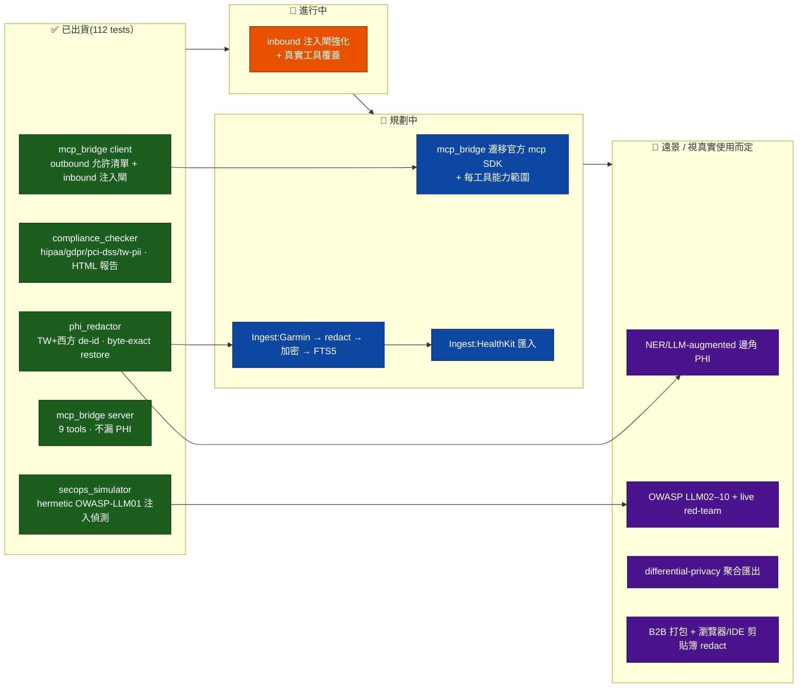

# 路線圖(視覺化）— phantom-secure-connector

> ARCHIVED 2026-06-19 — 內容已併入 docs/phantom-secure-connector.md;此為歷史版本。

> 🌐 英文狀態 SSOT 為 [`ROADMAP.md`](ROADMAP.md);OSS 選型依據見
> [`docs/OSS-LANDSCAPE-AND-DIRECTION.md`](docs/OSS-LANDSCAPE-AND-DIRECTION.md)。
> 本檔為繁中視覺化導覽,**不重複**狀態清單;以 `master` 已合併 commit 為錨,日期
> 2026-06-19。衝突時以英文 `ROADMAP.md` 為準。

---

## ① 定位 + 護城河

**一句話定位**:「敏感資料安全進來、可信工具安全出去、行為被紅藍隊持續驗證 —
phantom-mesh 的資料平面守門員。」

**護城河 🏰**(不是單點,而是「組合 × 在地化 × 零依賴」):

- 🔐 **組合**:`de-id` + `合規掃描` + `inbound 注入閘` + `MCP` 一站式 —
  Presidio 只做 de-id、Lasso 只做 gateway、Garak 只做 red-team,沒人把四件事
  全本地組起來。
- 🇹🇼 **在地化**:台灣身分證 / 健保卡 / 病歷號 **與** 西方 SSN/DOB/MRN/Email
  同管線處理。
- 📦 **零依賴**:核心 stdlib-only、跨 Mac/Win/Linux 行為一致 — 本身就是對
  Presidio(spaCy)/ Airbyte(Docker)的差異化。
- 🤝 **mesh 原生**:進 phantom-mesh memory 前先 redact、離開的工具呼叫過閘,
  與 governor + 雙閘 + 手機核准同一條治理鏈。

---

## ② 狀態流(Mermaid)

---

## ③ 分期表

> 排序原則(依單人多機 + 多 AI 開發模型):**便宜高值先 → 護城河先 →
> 需真實裝置(Garmin/iOS)/操作者決策的後。** 寫 = codex/claude;審 = ≥2
> distinct-AI(codex/opencode/agy);過 governor + 雙閘 → 手機核准。
> OSS 一律標「候選方向」,不預先綁定。

| 階段 | 目標 | 具體項(2–4) | 在哪台機 + 哪 AI | 風險前置 |
|---|---|---|---|---|
| **P-A** 🟢 MCP/閘 收尾 | 把純軟體、最便宜高值的部分做完(不需真裝置) | ① `mcp_bridge` 遷移**官方 mcp SDK**(候選方向) ② 每工具 capability scoping ③ inbound 注入閘再擴(LLM02 前哨) | z13 / M5 寫=codex→claude;審=opencode+agy | SDK 是否穩定到不重新引入依賴 churn;遷移前先寫對照測試,行為不退步 |
| **P-B** 🟡 Ingest 契約 + Garmin | 定義 source-connector 介面,接第一個來源(Garmin 走 web API,**不需 iOS**) | ① Singer-shaped source 介面(候選參考 Singer/Meltano,不採 runtime） ② 接 **python-garminconnect**(候選方向,鎖 extras flag 保核心零依賴) ③ Garmin rows → `phi_redactor` → `compliance_checker` → 加密 → FTS5 | acer / ayaneo 寫=codex→claude;審=agy+opencode | 真實 Garmin 帳號 = 操作者決策;先用合成資料跑通契約,真裝置只在最後一哩 |
| **P-C** 🟠 HealthKit 匯入 | 消費 Apple Health 匯出(**不自建 iOS app**) | ① 解析 Apple Health export XML(候選參考 apple-health-grafana 解析器) ② 或接 **Open Wearables** 正規化 feed / Health Auto Export push(候選方向 — **包不重造**) ③ 走同一條 redact→加密→FTS5 | Android/iOS 端取資料 → z13 處理;寫=claude;審=codex+agy | 需 iOS 裝置/操作者匯出 → 排在 Garmin 之後;避免重造 provider 正規化 |
| **P-D** 🟣 進階(opt-in 重) | 只有當真實使用證明 regex 漏接才做 | ① **Presidio** NER 後置(候選方向,`--ner` flag、僅本地模型) ② OWASP LLM02–10 + live red-team ③ ARX 式 differential-privacy 聚合匯出(候選參考) | M1 / z13 寫=codex→claude;審=opencode+agy | LLM-augmented de-id 本身可能漏 PHI → 必須本地模型 + 明確同意閘;否則不做 |

---

## ④ 刻意不做 / over-build 邊界

| ⛔ 不做 | 為什麼 | 取而代之 |
|---|---|---|
| 變成 **Airbyte**(300+ connector ETL 平台) | 單人不需要 Docker + Temporal 重平台;護城河是「安全」不是「廣」 | 2 個來源(Garmin/HealthKit)做到安全 > 20 個做到鬆散 |
| **重造 Open Wearables** 的 provider 正規化 | OAuth + 跨 Apple/Garmin/Samsung schema 是別人維護的無差異重活 | **包它**,本репо只加 de-id/合規/注入閘 那層 |
| 核心 import **重依賴**(spaCy/transformers/requests) | 破壞 stdlib-only 跨平台 + 供應鏈零信任承諾 | 一律鎖 **extras flag**,核心永不 import |
| **guardrail-as-a-service**(雲端 API 閘,如 Lasso 最強檢查) | 隱私優先工具把資料送雲端 = 自相矛盾 | 注入閘**全本地**(現況已是) |
| 重新接回 **anomaly_detector** | 已移至 phantom-companion(`011cee7`) | 時序異常不屬本репо |
| 過度宣稱 **「HIPAA Safe Harbor 合規」** | de-id ≠ 匿名化;quasi-identifier 連結風險仍在 | 維持現有誠實措辭:「redaction + 合規**掃描**輔助」 |

---

> 🔁 開發節奏:`design → 持久計畫 → off-main worktree → TDD → ask.sh 雙閘 →
> 對抗式驗證 → 批次合併`。每筆非瑣碎變更需 **≥2 distinct-AI LGTM**。
> 細節見英文 [`ROADMAP.md`](ROADMAP.md) 與
> [`docs/OSS-LANDSCAPE-AND-DIRECTION.md`](docs/OSS-LANDSCAPE-AND-DIRECTION.md)。
